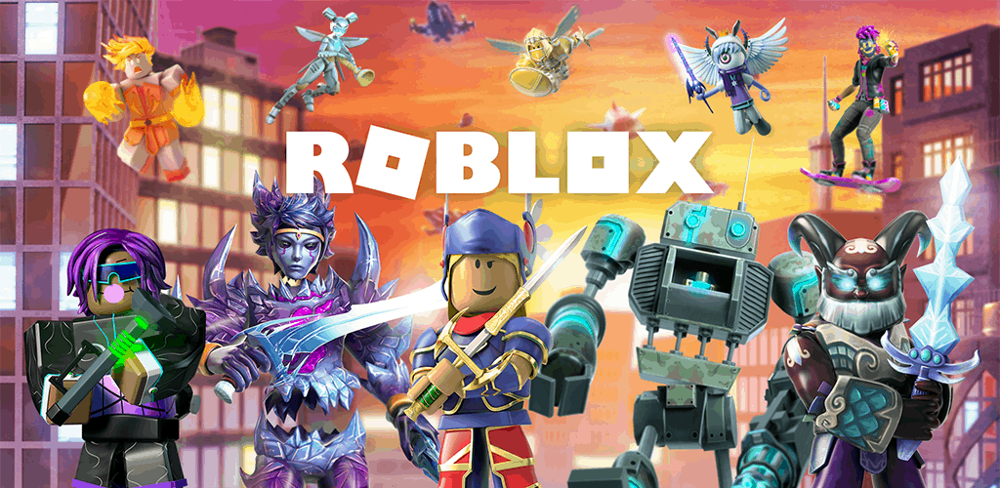

# 🎮 Roblox-Lua-Scripts-Collection



[](https://www.linkedin.com/in/pejman-ebrahimi-4a60151a7/)
[](https://huggingface.co/arad1367)
[](https://arad1367.github.io/pejman-ebrahimi/)
[](https://www.uni.li/pejman.ebrahimi?set_language=en)

## 📋 Overview

Welcome to my collection of Roblox Lua scripts! This repository contains various examples and showcases of different functionalities you can implement in Roblox Studio using Lua programming. Each script demonstrates specific game mechanics and features that can be used as learning resources or building blocks for your own Roblox games.

## 🚀 Featured Scripts

### 🌟 Core Functionalities
- **Transporter Game** - Teleportation mechanics and player movement systems
- **Fire Touch** - Interactive fire elements with touch detection
- **Exploit Object** - Advanced object manipulation and interaction systems
- **And many more...**

## 📁 Repository Structure

```
Roblox-Lua-Scripts-Collection/
├── TransporterGame/
│   ├── script.lua
│   └── Demo.png
├── FireTouch/
│   ├── script.lua
│   └── Demo.png
├── ExploitObject/
│   ├── script.lua
│   └── Demo.png
└── [Additional Scripts]/
    ├── script.lua
    └── Demo.png
```

## 🛠️ Getting Started

### Prerequisites
- Roblox Studio installed on your computer
- Basic understanding of Lua programming
- Familiarity with Roblox Studio interface

### How to Use These Scripts

1. **Clone the repository:**
   ```bash
   git clone https://github.com/arad1367/Roblox-Lua-Scripts-Collection.git
   ```

2. **Open Roblox Studio**

3. **Navigate to the desired script folder**

4. **Copy the Lua code from the script file**

5. **Paste it into a ServerScript or LocalScript in Roblox Studio**

6. **Follow the specific instructions in each script**

## 📚 Script Categories

### 🎯 Game Mechanics
- Player interaction systems
- Object manipulation
- Environmental effects

### 🔧 Utility Scripts
- Helper functions
- Common game patterns
- Reusable components

### 🎨 Visual Effects
- Particle systems
- Lighting effects
- Animation scripts

## 🤝 Contributing

Contributions are welcome! If you have interesting Roblox Lua scripts to share:

1. Fork the repository
2. Create a new branch for your script
3. Add your script with proper documentation
4. Submit a pull request

## 📖 Learning Resources

- [Roblox Developer Hub](https://developer.roblox.com/)
- [Lua Programming Guide](https://www.lua.org/manual/5.1/)
- [Roblox Scripting Tutorials](https://developer.roblox.com/en-us/learn-roblox/all-tutorials)

## 📞 Contact

**Pejman Ebrahimi**
- 📧 Email: pejman.ebrahimi77@gmail.com
- 💼 LinkedIn: [Connect with me](https://www.linkedin.com/in/pejman-ebrahimi-4a60151a7/)
- 🌐 Website: [Visit my portfolio](https://arad1367.github.io/pejman-ebrahimi/)

## 📄 License

This project is open source and available under the [MIT License](LICENSE).

## ⭐ Support

If you find these scripts helpful, please consider:
- ⭐ Starring this repository
- 🍴 Forking it for your own projects
- 📢 Sharing it with other Roblox developers

---

*Happy scripting in Roblox! 🎮*
